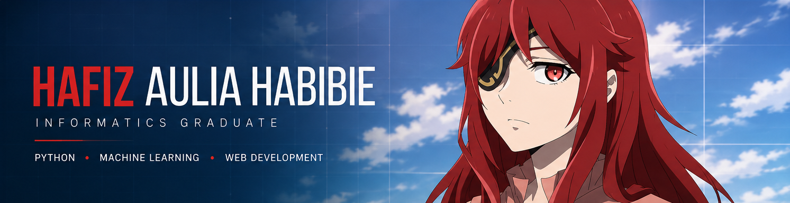

  

<h1 align="center">Hafiz Aulia Habibie</h1>

  <b>Informatics Graduate · Python · Machine Learning · Web Development</b>

  Building practical software and data-driven applications from ideas,
  problems, and a little bit of curiosity.

  
  &nbsp;
  
  &nbsp;
  

---

## 👨‍💻 About Me

I'm an Informatics graduate interested in **software development**,
**machine learning**, and **data-driven applications**.

I enjoy turning ideas and real-world problems into working software —
from web applications and interactive prototypes to machine learning systems.

- 🎓 Bachelor of Informatics — Class of 2026
- 💻 Interested in Software Development & Machine Learning
- 🧠 Exploring practical applications of data and AI
- 🌐 Also interested in Web Development
- 📍 Indonesia

---

## 🧰 Tech Stack

### Languages & Fundamentals

  
  &nbsp;&nbsp;
  
  &nbsp;&nbsp;
  
  &nbsp;&nbsp;
  
  &nbsp;&nbsp;
  

### Machine Learning & Data

  
  &nbsp;&nbsp;
  
  &nbsp;&nbsp;
  

`K-Nearest Neighbors` · `Random Forest` · `Temporal Evaluation` · `FastF1`

### Web Development

  
  &nbsp;&nbsp;
  
  &nbsp;&nbsp;
  
  &nbsp;&nbsp;
  
  &nbsp;&nbsp;
  

### Browser & Interactive Applications

  

`HTML5 Canvas` · `IndexedDB` · `Web Crypto API` · `Service Workers` · `LocalStorage`

### Databases & Storage

  
  &nbsp;&nbsp;
  
  &nbsp;&nbsp;
  

### AI, APIs & Services

  
  &nbsp;&nbsp;
  

`Gemini API` · `Serverless Functions` · `Midtrans Sandbox`

### Game & Simulation Development

`Pygame` · `HTML5 Canvas` · `Game Loops` · `Enemy AI` · `Local Save Systems`

### Media & Utilities

  

`yt-dlp`

### Networking

`UDP Sockets` · `Client–Server Architecture` · `DNS Concepts`

### Development Tools

  
  &nbsp;&nbsp;
  
  &nbsp;&nbsp;
  

---

## 🎯 What I Build

- 🤖 Machine Learning Applications
- 📊 Data-Driven Systems
- 🌐 Web Applications
- 🧩 Interactive Prototypes
- ⚙️ Software that combines data, logic, and real-world problems

---

## 🌱 Currently

I'm currently organizing and refining the projects I've built throughout
my Informatics studies while preparing to begin my professional career in tech.

The next step is turning those projects into well-documented,
publicly accessible work here on GitHub.

---

  <i>Always learning. Always building.</i>

